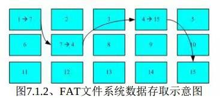

# 2.5收获

## work

遇到有高低位匹配的，或者信息传递的，一定要弄清楚信息流，从哪进，到哪去。

## Linux

which 指令 搜寻

第7章 Linux磁盘与文件系统管理

索引式文件系统有点像数组分布，但是每个索引可能有几个node，（不是hash，hash的节点一般是链式储存）


而FAT就像链表一样，




Ext2系统是索引式文件系统，每个block仅能容纳一个文件，如果选择block很大的

格式化方式，当存储很多小文件（比一个block还小）的时候就会造成浪费。

这一章 看的又不是很仔细， 感觉有点像操作手册。。。 用的时候自然会去查

## leecode

[1208. 尽可能使字符串相等](https://leetcode-cn.com/problems/get-equal-substrings-within-budget/)

滑窗！有点开心的 一次就ac了，还是中等题。

前两天的每日一题有感觉了。看了别人的答案之后发现，他们都是直接char相减用隐式类型转换，我之前还把每个字符串转到数组保存起来 没有必要！


```c++
class Solution {
public:
    int equalSubstring(string s, string t, int maxCost) {
        const int m = s.length();
        const int n = t.length();
        int left = 0;
        int right = 0;
        int cost = 0;
        for(right = 0;right < min(m, n);++right)
        {
            cost +=abs(s[right] - t[right]);
            if(cost > maxCost)
            {
                cost -= abs(s[left] - t[left]); // 这两句话是精髓，当cost超过边界的时候，左右同时++，滑窗前移，如果第二圈还是大于边界，继续往前走，结果不会变 还是保存了最长的字符串长度！妙妙妙
                left++;
            }
        }
        return right - left;
    }
};
```

## labuladong的算法小抄

二叉树第三期

[297. 二叉树的序列化与反序列化](https://leetcode-cn.com/problems/serialize-and-deserialize-binary-tree/)

[652.寻找重复的子树（中等）](https://leetcode-cn.com/problems/find-duplicate-subtrees)

序列化 看懂了 但是寻找重复子树还是没懂

可以在序列化的过程中，使用哈希表保存每一个节点，之后再遇到就统计

